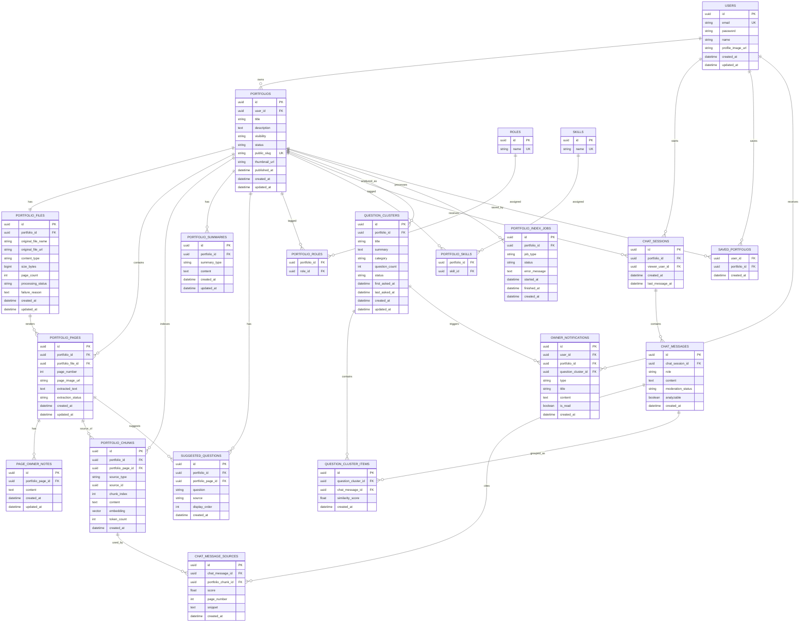

# Portfolio Chatbot ERD

포트폴리오 챗봇 서비스의 백엔드 ERD입니다. 모든 엔티티 식별자는 UUID를 사용합니다.

## 주요 Enum

| 구분 | 값 |
| --- | --- |
| `portfolio.status` | `DRAFT`, `PROCESSING`, `READY`, `PUBLISHED`, `FAILED`, `DELETED` |
| `portfolio.visibility` | `PRIVATE`, `PUBLIC`, `LINK_ONLY` |
| `portfolio_chunk.source_type` | `PDF_TEXT`, `OWNER_NOTE`, `SUMMARY` |
| `chat_message.role` | `USER`, `ASSISTANT`, `SYSTEM` |
| `moderation_status` | `PENDING`, `PASSED`, `BLOCKED` |
| `question_cluster.category` | `PROJECT_ROLE`, `TECH_STACK`, `CAREER`, `DESIGN_DECISION`, `IMPLEMENTATION_DETAIL`, `COLLABORATION`, `ACHIEVEMENT`, `UNCLEAR_PORTFOLIO_CONTENT`, `IRRELEVANT`, `ABUSIVE` |
| `question_cluster.status` | `OPEN`, `REVIEWED`, `RESOLVED`, `IGNORED` |
